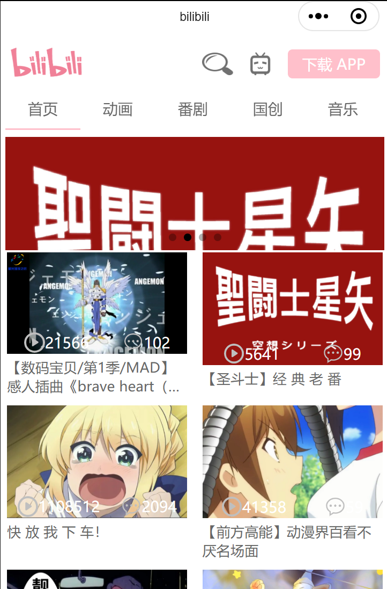
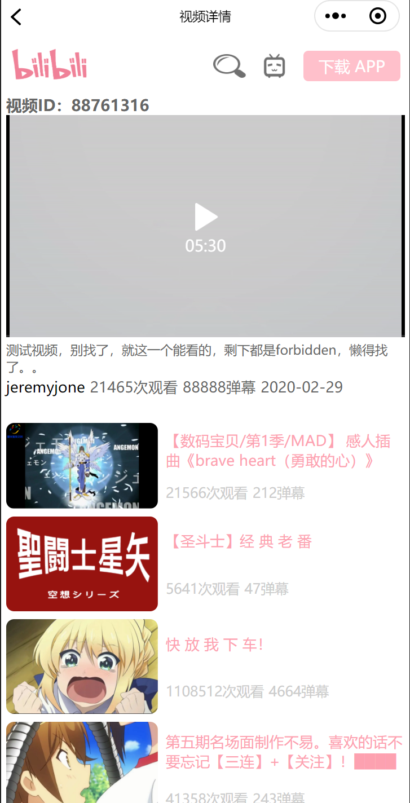

# 微信小程序 BILIBILI demo

本程序根据 BILIBILI 视频（bilibili.com/video/av40455083 ）学习手工制作。

## 前置内容

你需要会 HTML，JS，CSS3 的基本内容，这样看这个最起码能看懂。如果会 Vue 的话，更好，很好明白，逻辑方式都差不多。

## 成品

## 关于视频中的一些说明

视频中的一些内容是过时不可用的或者本人没有使用的，在这里说明一下。

### 1、关于接口

视频中的接口不能用了，但是这好像并不影响学习（关弹幕保智商）。。。自己写了一个 mock，在[https://www.fastmock.site/](https://www.fastmock.site/)，有兴趣可以自己写一个。

BILIBILI 官方提供的接口参见以下网站，我的接口就是从这里找的：[https://www.bilibili.com/read/cv3430609/](https://www.bilibili.com/read/cv3430609/)

本程序的测试接口我不删除，如果不能用了，那应该是网站没了。。。另，接口数据我单放在[./mock](./mock)文件夹下了，有兴趣的朋友也可以单机测试。

视频文件我就找了一个，所以播放永远只有一个视频，但是我在上面特意加了 ID 号，用来证明确实切换了界面。

### 2、图标

视频中的 icons 图标，我是自己从[阿里巴巴矢量图标库](https://www.iconfont.cn/)找的，各位可以自行替换。

另外，主页中两个画面下方的小图标，我用的 svg。由于微信不支持直接插入`<svg>`标签，而必须使用 base64 作为背景图，所以我进行了转换，并放在源码中。

转换的过程：

- 下载 svg 文件
- 打开网页：[https://www.sojson.com/image2base64.html](https://www.sojson.com/image2base64.html)，把下载的 svg 文件上传，然后它会自动转换
- 将转换好的 base64 字符串放到 wxss 文件中，作为`background-image: url("base64")`使用

## 微信开发者工具

视频中的一些参数或者使用方法已经过时了，所以照着视频敲的代码可能会报错，最新的方法还是参照官方文档吧。[https://developers.weixin.qq.com/](https://developers.weixin.qq.com/)
